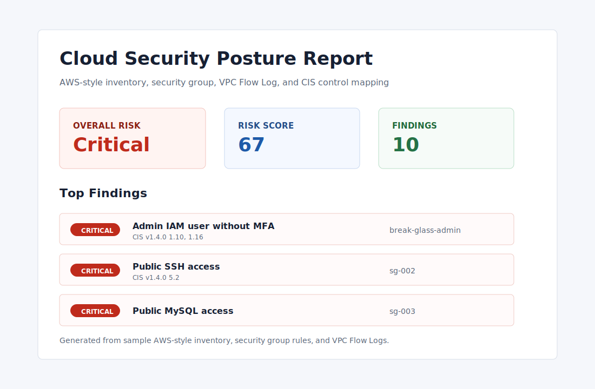
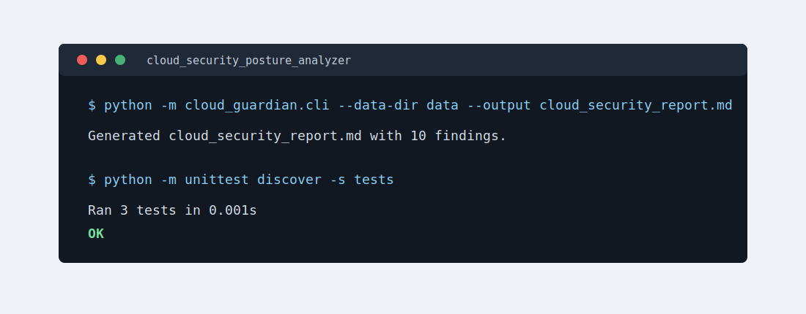

# Cloud Security Posture Analyzer

A beginner-friendly cloud and cybersecurity portfolio project that analyzes AWS-style security data and produces a prioritized posture report.

This project started from basic Python lab practice and was rebuilt into a small, practical tool that demonstrates cloud fundamentals, network exposure analysis, IAM hygiene, file parsing, risk scoring, and clean documentation.

## Preview





## What It Does

- Reviews security group rules for public exposure of administrative and sensitive ports.
- Checks AWS-style inventory for public S3 buckets, weak bucket encryption, privileged IAM users without MFA, and old access keys.
- Reviews VPC Flow Log samples for repeated rejected traffic against administrative ports.
- Maps applicable findings to CIS AWS Foundations Benchmark v1.4.0 controls.
- Scores findings by severity and generates a Markdown report that can be shared with technical and non-technical readers.

## Why This Matters

Entry-level cloud, network, and cybersecurity roles often require the ability to read logs, understand exposure, explain risk, and recommend practical remediation. This project shows those skills using plain Python and realistic AWS-style data.

## Skills Demonstrated

- Python standard library: `csv`, `json`, `argparse`, `ipaddress`, `dataclasses`, `pathlib`
- AWS security concepts: security groups, S3 public access, IAM MFA, access key rotation
- Network security concepts: public vs private IP space, administrative ports, VPC Flow Logs
- Governance concepts: CIS AWS Foundations Benchmark alignment and control mapping
- Security reporting: severity, evidence, remediation, executive summary
- Testing with `unittest`
- Clean project organization suitable for GitHub

## Project Structure

```text
cloud_security_posture_analyzer/
+-- data/
|   +-- aws_inventory.json
|   +-- security_groups.csv
|   +-- vpc_flow_logs.csv
+-- src/
|   +-- cloud_guardian/
|       +-- __init__.py
|       +-- analyzer.py
|       +-- cli.py
+-- tests/
|   +-- test_analyzer.py
+-- docs/
|   +-- report-preview.svg
|   +-- terminal-preview.svg
+-- cloud_security_report.md
+-- .gitignore
+-- README.md
```

## Quick Start

From the project folder:

```powershell
$env:PYTHONPATH = "src"
python -m cloud_guardian.cli --data-dir data --output cloud_security_report.md
```

On macOS or Linux:

```bash
PYTHONPATH=src python -m cloud_guardian.cli --data-dir data --output cloud_security_report.md
```

A generated sample report is included at `cloud_security_report.md`.

## Run Tests

```powershell
$env:PYTHONPATH = "src"
python -m unittest discover -s tests
```

## Example Findings

The included sample data intentionally contains issues such as:

- Public SSH access from `0.0.0.0/0`, mapped to CIS AWS Foundations v1.4.0 control 5.2
- Public MySQL exposure
- A privileged IAM user without MFA, mapped to CIS AWS Foundations v1.4.0 controls 1.10 and 1.16
- Public S3 bucket configuration, mapped to CIS AWS Foundations v1.4.0 control 2.1.5
- Old IAM access keys, mapped to CIS AWS Foundations v1.4.0 control 1.14
- Rejected public traffic targeting administrative ports

## Compliance Note

This project includes CIS AWS Foundations Benchmark v1.4.0 alignment for selected checks. It is an educational portfolio project, not a complete CIS audit or compliance certification tool.

## Suggested GitHub Description

Python tool that analyzes AWS-style inventory, security groups, and VPC Flow Logs to identify cloud security risks, map applicable findings to CIS AWS Foundations controls, and generate a prioritized Markdown report.

## Future Improvements

- Add support for real AWS exports from the AWS CLI.
- Export findings as JSON for SIEM or ticketing workflows.
- Expand CIS AWS Foundations coverage across CloudTrail, AWS Config, logging, and monitoring checks.
- Add severity filtering to the command-line interface.
